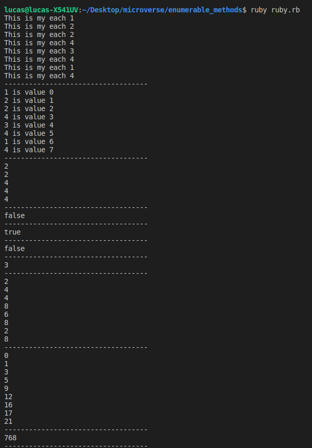

# _Enumerable Methods_

> Based on our new knowledge of ruby, we attempted to make another version of some Enumerable methods, this is our result.

(Please keep in mind the style required in the terminal)

## Details  

### How to use
- Select the method you want to use (They work the same as the original ones, even with empty arrays)
  - `my_each, my_map, my_select, etc`
- You can use the same array as the une I have in the program or modify it.
- Run the program using ruby 
  - `ruby bubble.rb`

## Built With

- Ruby
- VSCode

## Authors

👤 **Lucas Mazo**
- Github: [@lucasmazo32](https://github.com/lucasmazo32)
- Twitter: [@lucasmazo32](https://twitter.com/lucasmazo32)
- Linkedin: [Lucas Mazo](https://www.linkedin.com/in/lucas-mazo-meza-55a65b159/)
